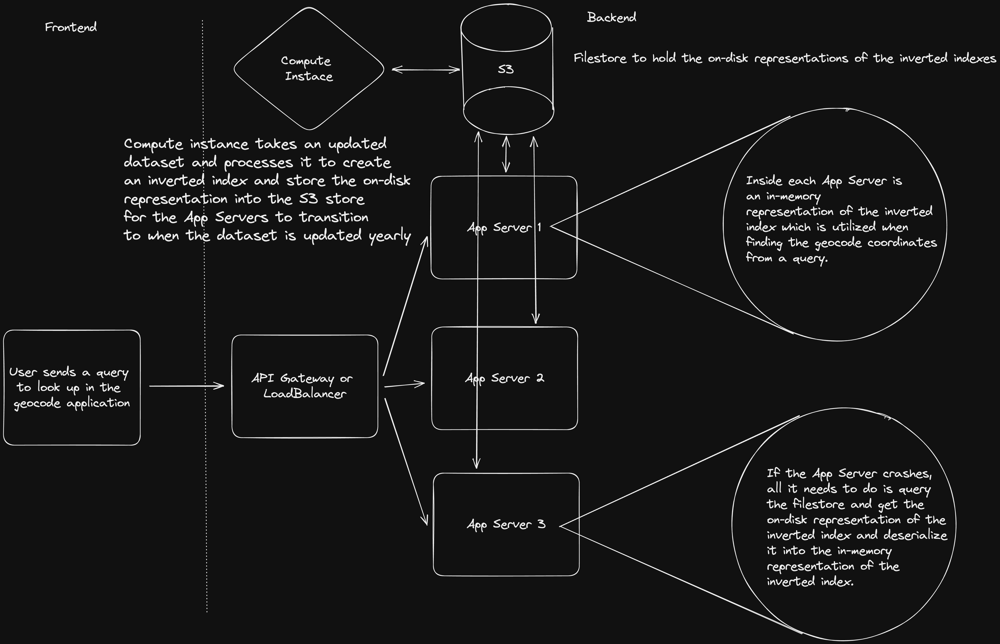
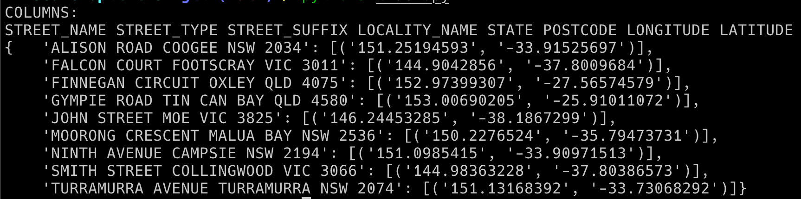
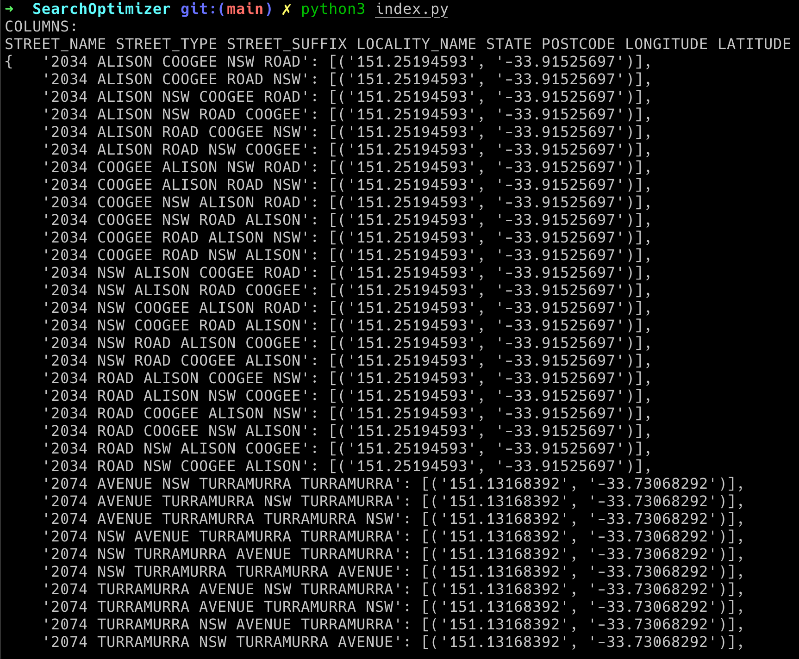

Design a Geocode Address Lookup Design that has Better Performance / Error Handling / Availability than throwing data into ElasticSearch

- Elastic Search Performance is around 200ms per query
	- Want to improve to something better than that

Data:
- 5 - 10 GB text file that is very clean and normalized (no duplicates as well) with addresses and latitude / longitude sizes
- basically get a format of ['STREET_NAME', 'STREET_TYPE', 'STREET_SUFFIX', 'LOCALITY_NAME', 'STATE', 'POSTCODE', 'GEOCODE_TYPE', 'LONGITUDE', 'LATITUDE']
	- Street name: Actual Street name in the address
	- Street type: Ave, road, st. etc.
	- Street suffix: ??
	- Locality name: the local region within the state of the full address (kind of like city)
	- State: the state in the country
	- Postcode: the postal code
	- Geocode Type: ????
	- Longitude: longitude coordinates for the geocode
	- Latitude: latitude coordinates for the geocode

Goal:
- Optimize going from Address -> Geocode Coordinate
	- Don't need to worry about the reverse look up
- Design should include dealing with some form of error handling for misspelled addresses, missing some of the exact fields
- Timing is only at query time but there can be an index and a query stage

Constraints
- Assume the timing is from when the request is made from the backend App Server to the underlying query system
- Underlying data changes very infrequently
	- A lot of the computation time should be spent on indexing in a manner that makes it very quick to query
- Query comes in as one string, up to us to parse it and utilizes portions of the string that makes sense
	- Delimited by spaces for each portion of the address
	- Address can also come at random orders but we still want it to return a geocode
		- ex. 9th ave NYC NY 20233
		- vs. NYC 9th ave 202323 NY

Useful Hints
- Edit Distance
	- Want to calculate edit distances at index time since the data changes very infrequently so we can get away with taking an extended amount of time indexing the entries
- Inverted Indexes
	- Keys are the street addresses 
	- Values are a list of possible geocode coordinates
- N-gram index:
	- store pairs / permutations of a word and to a valid geocode address


Running Questions:
- How do we rank the results since some inputs such as "av" can return multiple addresses?
- Do we want to match the entire string or do we want to match each portion of the address?
- Do we want to add any computation to the actual query time?
	- Probably not since the data changes very infrequently, want the querying system to be as dumb as possible where it just looks up the address as a key look up
	- Does that reduce accuracy?
- Do we want unique results or return a list of results and the user can chose?

# Design

## Overall

Want the design such that at query time, it will be just a hash index look up into the In-Memory representation of the inverted index that is going to hold all of the different street addresses and their permutations to geocode coordinates.

## Latency

The goal is to reduce the amount of latency from the service as much as possible upon querying time. There are 2 factors to consider in this design:

1. Network Latency
2. Computational Latency

TODO: Perform and Link simulations for estimating the computational latency 

### Network Latency

One form of latency that can arise is due to the actual network latency occurred on a roundtrip from the request to the response. In my design, I was thinking about dealing with this and effectively reducing this to 0, in the perspective of from the App Server to the querying service.

The idea would be to have some on disk representation of the inverted index that will be generated at index time and each of the App Servers will import this inverted index in their Server Process and queries to the inverted index will be routed to the Application's In-Memory representation of the inverted index that was converted from the on disk representation of the inverted index.

This will reduce the network latency in the overall system to 0 (excluding from the client to the server).

The reason that this is possible is that the data set is small enough in size that when turned into an inverted index, it won't exceed the size of physical RAM available in most computing systems. Although it will be greater than that of about 10 GB which will incur higher costs in Cloud Computing, it shouldn't be that bad.

TODO: Link this with an estimation of the size of the inverted index when in memory
TODO: Cost analysis comparing nodes with higher amounts of memory vs. using ElasticSearch on AWS

### Computational Latency

Computational latency is where a majority of the latency costs will be incurred. This can be split up into 2 portions:

1. Time to Index
2. Time to Query

In my design, to lower the query time as much as possible (as that is what users will see real time), I decided that all of the cost should be incurred in the time to index instead of the time to query.

The design should be made such that when a query enters the system, the query time computation is just a lookup in a key-value store (represented by the inverted index) and it should retrieve the geocode location corresponding to the key from the query.

At indexing time, the keys that are indexed into the inverted index should be such that all of the permutations, fuzzing, n-grams, etc. are already indexed into inverted index and correspond to possible inputs into the query that resolve to a geocode coordinate. This allows the query to just return the geocode through a key-value look up.

For example, if there is a query:

	9th Coolio Ave, NYC, NY, 11298

the indexing operation will try to generate all the possible mutations such as:

	Coolio 9th Ave, NYC, 11298, NY

	Coolie 9th Ave, NYC, 11298, NY

	...


and they all resolve to the same geocode coordinate location.

The reason that this is possible is because of the constraint that the dataset rarely changes (once a year). This gives us significant time to spend on the actual processing of the dataset to create the inverted index.

TODO: Link the workflow, pseudocode of the indexing mechanism

## Storage

To deal with recovery, the inverted index or the some form of the data should be stored somewhere. This is to deal with the sceneario where the Application Server crashes and needs to regenerate the In-Memory inverted index.

We can implement a custom schema for this inverted index to store on-disk and have a serializer / deserializer regenerate the In-Memory representation of the Inverted Index.

TODO: Create and Link the custom schema to represent the inverted index on disk

The idea is that once a year when we get an update to the data we can have a background process that does the indexing computation and then creates an inverted index in memory in that process. The process can then utilize this schema so that it converts the inverted index into the on-disk representation and stores it in the filesystem mounts connected to the Application Servers. The Application Servers can then utilize this newly indexed inverted index and convert it to the In-Memory Representation.

In this manner, we can also avoid having any downtime when indexing while still maximizing the performance of query time.

TODO: Calculate estimations for how big the In-Memory and On-Disk representation of the Inverted Index will be.

## Diagram



## Pseudocode

While at a systems level the design might make sense, there is a lot still left in the nitty gritty of the actual pseudocode and the algorithms / data structures utilized. 

In my design the majority of the complexity lies in the actual indexing.

### Indexing

The indexing portion of the system is a bit more complicated since one of the constraints is that if the query is within the error tolerance (in terms of spelling mistakes, missing portions of the address, etc.), that query needs to have a corresponding entry to a geocode coordinate.

To start off, we can define the rules of how much error tolerance we will allow for entries into the inverted index:

1. The order that the address is entered should not matter
2. The address is split on white spaces meaning CoolioStreet will be treated as literally "CollioStreet" the system should not detect that this should be split up
3. For each word split on whitespace, there will be a edit distance of 2 that is allowed before that word will not have a corresponding geocode coordinate entry
4. Each entry is allowed to have multiple geocode coordinates for that entry and in the event that multiple geocodes are found, all of them are returned
5. Entries should be created through combinations of sets of the fuzzed values of each column in the dataset
* There is a special rule for the `STREET_SUFFIX` where the possible inputs for abbreviations are hardcoded into the set for possible street suffixes

### High Level Workflow

The indexing portion should work as follows:

1. First when reading the data input you want to split up the different columns into their own sets
	- At the same time that you are reading each line, you want to input the exact query string into the inverted index with its geocode coordinate as the value
		- looks something like: 
	- In addition, we want to generate all permutations of the ordering of the columns in a particular address and store the geocode coordinate as a possible value
		- looks something like: 

2. We want to add to the set edit distances of 1 and 2 of each entry in the set for that column to the set for that column
3. We want to permute on all combinations of the sets and create a query string from it using one entry per column and then compare this edited string to the potential exact query string. If both strings are within 2 edit distances then we add the mutated query string as a key in the inverted index and add the geocode as a coordinate in to that query string

TODO: I need to time this since I am doing a bunch of permutations, I am not sure how long this will take

### Querying

The querying portion of the system is very simple and the design was intentionally made to keep it simple to reduce latency as much as possible.

The code would look something like this:

```python
	
def query(querystring: str):
	if invertedIndex.Contains(querystring):
		return invertedIndex[querystring.replace(",", "")]     # Want to remove all commas since they won't exist in the keys of the inverted index 
	else:
		return 404 

```


## Conclusion


